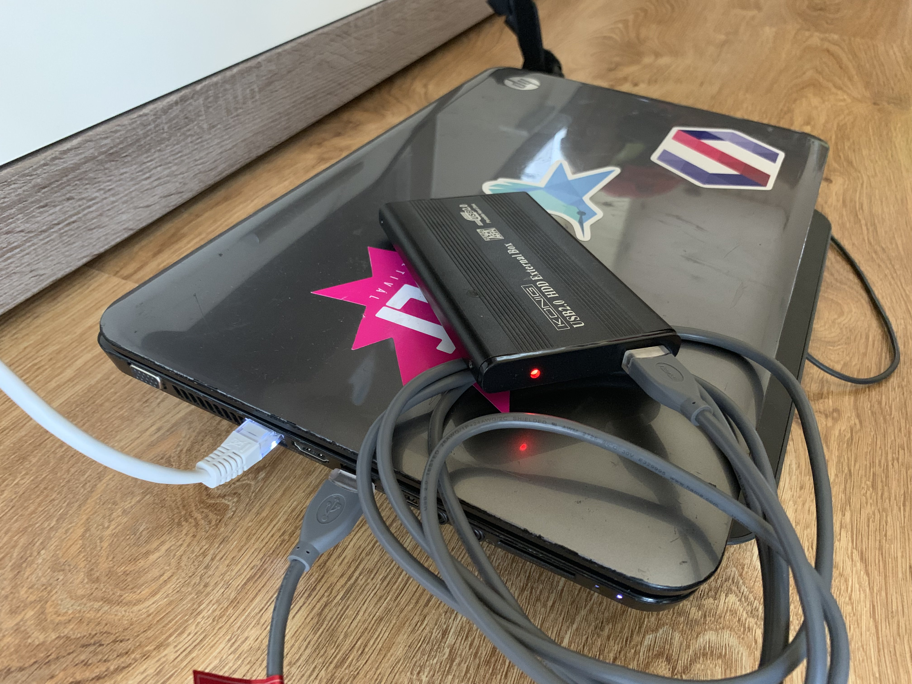

# Homemade Netflix with Plex
## My setup
- old laptop
- usb external hdd


0. Connect everything together
- Internet
- usb external hdd
- charger
1. Intall Ubuntu Server
- Download the latest Ubuntu Server https://www.ubuntu.com/download/server (I used this version: Ubuntu Server 19.04)
- Create a Bootable USB (Mac: https://tutorials.ubuntu.com/tutorial/tutorial-create-a-usb-stick-on-macos#0 Windows: https://rufus.ie/)
- Intall openssh during installation

##### From now you can work in your fresh operating system's terminal or you can use ssh if your server doesn't have screen or keyboard

2. Format external hdd to ext4 format

`mkfs.ext4 /dev/yourpartitionhere`

- mount usb for plex
https://forums.plex.tv/t/using-ext-or-ntfs-drives-internal-or-external-on-linux/198544
(I use /disks/media)

My commands and output based on the linked tutorial
```
username@server:~$ sudo mkdir /disks /disks/media
username@server:~$ sudo chown -R username:username /disks
username@server:~$ sudo blkid
/dev/sda2: UUID="35a9da47-5657-46ce-a62d-9cecd61169bd" TYPE="ext4" PARTUUID="e477fde7-aad4-4403-986b-33f873cdcdcb"
/dev/loop0: TYPE="squashfs"
/dev/loop1: TYPE="squashfs"
/dev/sda1: PARTUUID="3e08d444-372b-403b-91aa-4d6be38116a0"
/dev/sdb: UUID="8a32d2c1-50ba-4376-ba12-10ab0458c817" TYPE="ext4"
username@server:~$ sudo nano /etc/fstab
UUID=35a9da47-5657-46ce-a62d-9cecd61169bd / ext4 defaults 0 0
UUID=8a32d2c1-50ba-4376-ba12-10ab0458c817 /disks/media ext4 defaults,auto,rw,nofail 0 1
/swap.img       none    swap    sw      0       0
username@server:~$ mount /disks/media/
username@server:~$ ls  /disks/*
lost+found
username@server:~$ sudo reboot

username@server:~$ sudo find /disks/media -type d -exec chmod 755 {} \;
username@server:~$ sudo find /disks/media -type f -exec chmod 644 {} \;
username@server:~$ sudo mkdir /disks/media/tv /disks/media/movies
```
3. Dont sleep when lid closed (optional)

https://askubuntu.com/questions/15520/how-can-i-tell-ubuntu-to-do-nothing-when-i-close-my-laptop-lid

4. Install plex

Follow the instructions here: https://www.linuxbabe.com/ubuntu/install-plex-media-server-ubuntu-18-04
(you need just the first 2 part)

5. Setup Plex
- Find out your server local ip
```
username@server:~$ sudo ifconfig
eno1: flags=4163<UP,BROADCAST,RUNNING,MULTICAST>  mtu 1500
        inet 192.168.0.24  netmask 255.255.255.0  broadcast 192.168.0.255
        inet6 2001:4c4c:2223:ca00::3  prefixlen 128  scopeid 0x0<global>
        inet6 fe80::461e:a1ff:fee5:3658  prefixlen 64  scopeid 0x20<link>
        inet6 2001:4c4c:2223:ca00:461e:a1ff:fee5:3658  prefixlen 64  scopeid 0x0<global>
        ether 44:1e:a1:e5:36:58  txqueuelen 1000  (Ethernet)
        RX packets 129323  bytes 172781251 (172.7 MB)
        RX errors 0  dropped 4  overruns 0  frame 0
        TX packets 38219  bytes 15260172 (15.2 MB)
        TX errors 0  dropped 0 overruns 0  carrier 0  collisions 0
```
- Go to this site in a browser http://192.168.0.24:32400/web (use your local ip)
- Log in with Google
- Add TV(disks/media/tv) and Movies(disks/media/movies) library

6. Install Transmission
https://hub.docker.com/r/linuxserver/transmission/
```
username@server:~$ sudo apt install docker.io
username@server:~$ sudo docker create \
  --name=transmission \
  -e PUID=1000 \
  -e PGID=1000 \
  -e TZ=Europe/London \
  -e TRANSMISSION_WEB_HOME=/combustion-release/ `#optional` \
  -p 9091:9091 \
  -p 51413:51413 \
  -p 51413:51413/udp \
  -v ~/config:/config \
  -v /disks/media:/downloads \
  -v ~/watch:/watch \
  --restart unless-stopped \
  linuxserver/transmission
username@server:~$ sudo docker start transmission
transmission
username@server:~$ sudo docker stop transmission
transmission
username@server:~$ sudo nano config/settings.json
```
```
Securing the webui with a username/password.
this requires 3 settings to be changed in the settings.json file.
Make sure the container is stopped before editing these settings.
"rpc-authentication-required": true, - check this, the default is false, change to true.
"rpc-username": "transmission", substitute transmission for your chosen user name, this is just an example.
rpc-password will be a hash starting with {, replace everything including the { with your chosen password, keeping the quotes.
Transmission will convert it to a hash when you restart the container after making the above edits.
```
```
username@server:~$ sudo docker start transmission
username@server:~$ sudo chmod -R 777 /disks/meida/tv
username@server:~$ sudo chmod -R 777 /disks/meida/movies
```

- Go to this site: http://192.168.0.24:9091/transmission/web/ (use your local ip)

- add your first movie now by uploading a torrent file here, destination folder has been set to /downloads/movies

- Go to Plex web ui -> Settings -> Library->
Scan my library automatically
- Your library will be updated automatically when changes to library folders are detected.


7. Flexget

https://github.com/cpoppema/docker-flexget
```
username@server:~$ sudo mkdir flexgetconf

sudo docker create \
    --name=flexget \
    -e PGID=1000 -e PUID=1000 \
    -e WEB_PASSWD=yourhorriblesecret \
    -e TORRENT_PLUGIN=transmission \
    -e TZ=Europe/London \
    -e FLEXGET_LOG_LEVEL=debug \
    -p 5050:5050 \
    -v ~/flexgetconf:/config \
    -v /disks/media:/downloads \
    cpoppema/docker-flexget

username@server:~$ sudo docker ps -a
CONTAINER ID        IMAGE                      COMMAND             CREATED             STATUS              PORTS                                                                        NAMES
45a031f9210e        cpoppema/docker-flexget    "/init"             2 minutes ago       Created                                                                                          flexget
c3c7ffa374d9        linuxserver/transmission   "/init"             4 hours ago         Up 2 hours          0.0.0.0:9091->9091/tcp, 0.0.0.0:51413->51413/tcp, 0.0.0.0:51413->51413/udp   transmission

username@server:~$ sudo docker stop flexget
username@server:~$ sudo nano flexgetconf/config.yml
```
Here is my config, it downloads the series by title and movies which has more than 7 score and 5000 vote on imdb. More info here: https://flexget.com/Configuration
```
web_server: yes
templates:
  tv:
    series:
      settings:
        normal:
          timeframe: 3 hours
          target: 1080p
          quality: 720p-1080p
          set:
            path: /downloads/tv
      normal:
        - Game of Thrones
        - Your Favourite Series
    transmission:
      enabled: yes
      host: YOUR_LOCAL_IP
      port: 9091
      username: YOUR_TRANSMISSION_USERNAME
      password: YOUR_TRANSMISSION_PASSWORD
  movies:
    imdb_lookup: yes
    imdb:
      min_score: 7.0
      min_votes: 5000
      min_year: 2010
    seen_movies: strict
    transmission:
      enabled: yes
      host: YOUR_LOCAL_IP
      port: 9091
      path: /downloads/movies
      username: YOUR_TRANSMISSION_USERNAME
      password: YOUR_TRANSMISSION_PASSWORD

tasks:
  tvtask:
    priority: 1
    rss: YOUR_RSS
    template: tv
    notify:
      task:
        template: html  # Optional, if you want html instead of plain text
        via:
          - email:
              from: YOUR_EMAIL_FROM@gmail.com
              to:
                - YOUR_EMAIL_TO1@gmail.com
                - YOUR_EMAIL_TO2@gmail.com
              smtp_host: smtp.gmail.com
              smtp_port: 587
              smtp_username: YOUR_EMAIL_FROM
              smtp_password: YOUR_EMAIL_FROM_PASSWORD
              smtp_tls: yes
              html: yes # To parse template as HTML
  high_rated_movies:
    priority: 2
    rss: YOUR_RSS
    template: movies
    quality:
     - 1080p bluray
    notify:
      task:
        template: html  # Optional, if you want html instead of plain text
        via:
          - email:
              from: YOUR_EMAIL_FROM@gmail.com
              to:
                - YOUR_EMAIL_TO1@gmail.com
                - YOUR_EMAIL_TO2@gmail.com
              smtp_host: smtp.gmail.com
              smtp_port: 587
              smtp_username: YOUR_EMAIL_FROM
              smtp_password: YOUR_EMAIL_FROM_PASSWORD
              smtp_tls: yes
              html: yes # To parse template as HTML
  high_rated_movies_fallback:
    priority: 3
    rss: YOUR_RSS
    template: movies
    quality:
     - 1080p webrip+
    delay: 10 hours
    notify:
      task:
        template: html  # Optional, if you want html instead of plain text
        via:
          - email:
              from: YOUR_EMAIL_FROM@gmail.com
              to:
                - YOUR_EMAIL_TO1@gmail.com
                - YOUR_EMAIL_TO2@gmail.com
              smtp_host: smtp.gmail.com
              smtp_port: 587
              smtp_username: YOUR_EMAIL_FROM
              smtp_password: YOUR_EMAIL_FROM_PASSWORD
              smtp_tls: yes
              html: yes # To parse template as HTML
```
```
username@server:~$ sudo docker start flexget
username@server:~$ sudo docker exec -it flexget bash
root@45a031f9210e:/config$ rm -rf /config/.config-lock
root@45a031f9210e:/config$ flexget -c /config/config.yml web passwd yourhorriblesecret
```

- Flexget has a web UI here: http://192.168.0.24:5050 (use your local ip)

8. Port forwarding
- For the following ports: 32400, 9091, 5050. So you can access Plex, Transmission, Flexget from outside of your local network.

#### Extra information
NCORE RSS
ncore -> profile -> other data -> Passkey
YOUR_RSS: https://ncore.cc/rss.php?key=YOUR_PASS_KEY
